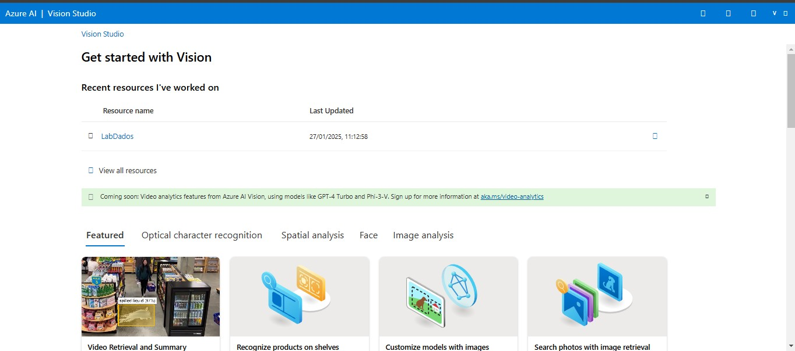

<h1>
    
     Reconhecimento Facial e transformação de imagens em Dados
</h1>

## Add captions to imagens
Recurso que transforma e detecta rostos em imagens.

01 - Dentro do Vision Studio na guia *Image analysis*, faça o Upload da imagem

...

02 - O recurso vai detectar o que esta na imagem:   

...

## Optical character recognition
Através deste recurso a Inteligência Artificial extrai o texto que conseguir identificar na imagem, util para escanear documentos e notas:

01 - 

...

02 - O recurso detecta o texto da imagem:

...

## Considerações Finais

 Os recursos são o futuro das inteligências Artificiais para diversos fins, seja ele para segurança ou para simples tarefas do dia-a-dia.
