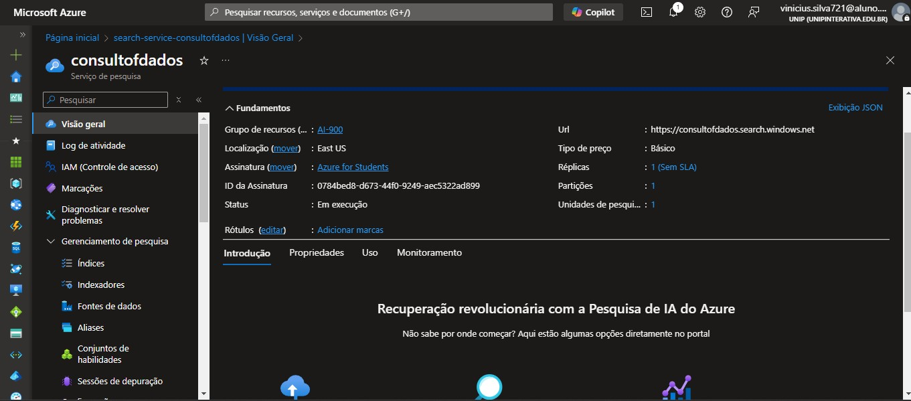
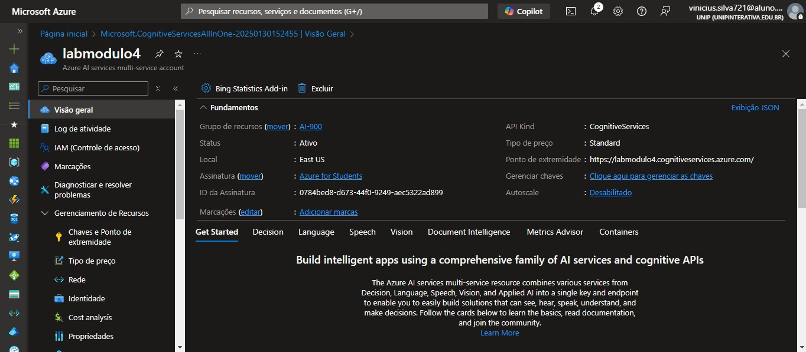
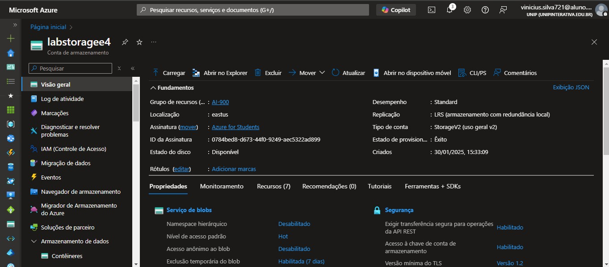
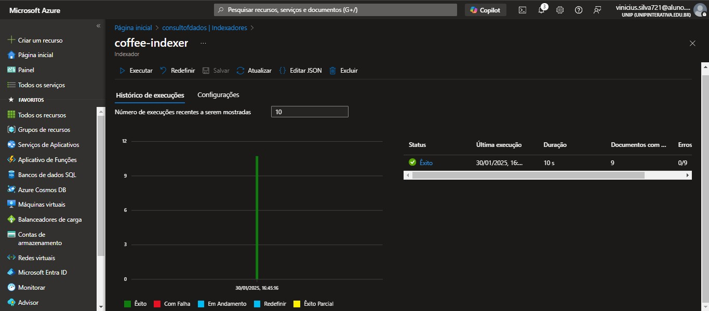
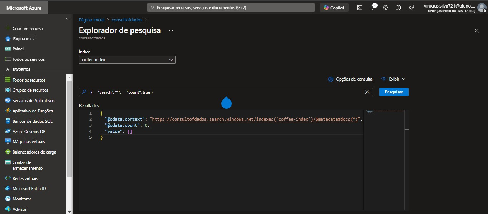
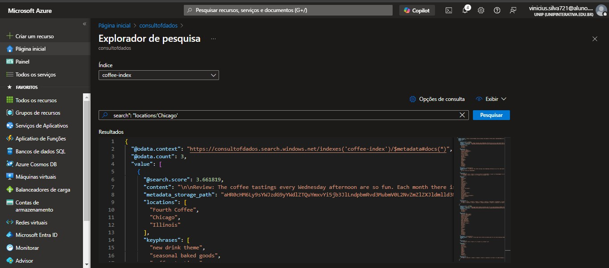

<h1>
    <a href="https://www.dio.me/">
     </a>
    <span> 
Azure Cognitive Search: Utilizando AI Search para indexação e consulta de Dados</span>
</h1>

## Problema:

O desafio propoe que seja criada uma pesquisa que funcione juntamente com um serviço de inteligência artificial para identificar palavras chave, sentimentos, utilizando também o serviço de armazenamento do azure. Foram utilizados os AI Search, Azure AI Services e Containers

[Documentação](https://microsoftlearning.github.io/mslearn-ai-fundamentals/Instructions/Labs/11-ai-search.html)

## Criando recurso do Azure AI Search:     



## Criando recurso do Azure AI services:      



## Criando o storage:      




## Indexação dados para o AI SEARCH:      



##  Cnsultando o índice:      

Após as configurações vamos voltar ao AZURE AI SERVICES, entrar no nosso serviço e através do SEARCH EXPLORER testar se foi indexado e se a consulta esta funcionando, utilizando os comandos:

```
search=*&$count=true    (  verifica se a indexação esta funcionando e mostra os documentos )
```



```
search=locations:'Chicago' ( Consulta as ocorrencias acontecidas em Chicado )
```



## Observações finais:      

As ferramentas de inteligência artificial do Azure otimizam a consulta em documentos, pesquisas e depoimentos, tornando mais ágil e eficiente a análise da satisfação das empresas em relação aos seus produtos e serviços.
